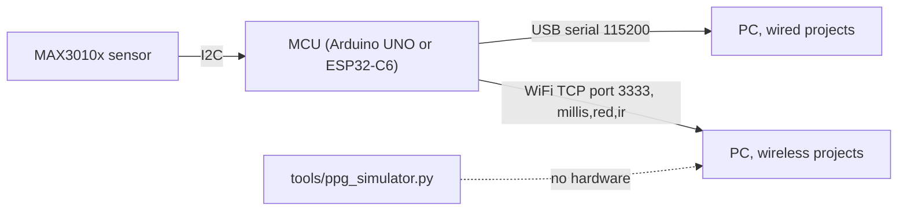

# Hardware

## Bill of materials

Per sensor node. Prices are rough 2026 street prices, for planning only.

| Part | Qty | ~USD | Notes |
|------|----:|-----:|-------|
| MAX30102 or MAX30105 breakout | 1 | 5 to 12 | The 30105 adds a green LED. Either works. Prefer a board with a 3.3 V regulator and level shifting. |
| Arduino UNO or Nano (wired) | 1 | 8 to 25 | Any AVR board with I²C. |
| Adafruit Feather ESP32-C6 (wireless) | 1 | 15 to 20 | Other ESP32 boards work. Update the I²C pins in the sketch. |
| LiPo battery 400 to 1000 mAh (wireless) | 1 | 6 to 10 | JST-PH, for recording without a cable. |
| Dupont jumper wires | 4 | 1 | GND, 3V3, SDA, SCL. |
| USB cable | 1 | 2 | Data-capable, not charge-only. |
| 3D-printed case (`hardware/stl/`) | 1 | about 0.2 filament | Two-piece clip that steadies the optical contact. |
| Hook-and-loop strap | 1 | 1 | Holds the case on a wrist or finger. |

Twelve people in groups of three need four nodes. Budget one spare sensor.

## Wiring

The same four wires for every board. The MAX3010x runs at 3.3 V logic.

```text
 MAX3010x            Arduino UNO/Nano        Feather ESP32-C6
 --------            ---------------         ----------------
   GND  ------------------ GND ------------------ GND
   VIN  ------------------ 3.3V ----------------- 3.3V
   SDA  ------------------ A4 / SDA ------------- SDA (IO19)
   SCL  ------------------ A5 / SCL ------------- SCL (IO18)
   INT  ------  not connected  ------
```



## Firmware

The sketches live in `hardware/`. Each one is a self-contained streamer with no project logic on
the MCU.

| Project | Wired sketch | Wired stream | Wireless sketch | Wireless stream |
|---------|--------------|--------------|-----------------|-----------------|
| 01, 02, 03, 05 | `wired-arduino/project-0X-ir-streamer/` | `time_us,ir` | `wireless-esp32/project-0X-wifi-ir-streamer/` | `millis,red,ir` |
| 04 | `wired-arduino/project-04-red-ir-streamer/` | `time_us,red,ir` | `wireless-esp32/project-04-wifi-red-ir-streamer/` | `red,infrared` |

The Python parsers take the last numeric value or values on each line, so timestamped and bare
formats both work. Projects 01 to 03 and 05 use IR only. Project 04 needs paired Red and IR.

### Required Arduino library

SparkFun MAX3010x Pulse and Proximity Sensor Library (`MAX30105.h`), installed from the Arduino
Library Manager. For ESP32 you also need the esp32 boards package.

### Wireless network modes

In Access Point mode, which is the default, leave `WIFI_SSID` and `WIFI_PASSWORD` on their
placeholders. The board creates `PPG_STREAM_groupN` with password `12345678`. Connect the PC's
WiFi to it and use host `192.168.4.1` and port `3333`. This is best for classrooms with
locked-down WiFi.

In router mode, set your WiFi credentials in the sketch, read the assigned IP from the Serial
Monitor, and use that IP with port `3333`.

## Sample rate

The sensor's effective output rate is `SAMPLE_RATE / SAMPLE_AVERAGE`.

| Sketch | `SAMPLE_RATE` | `SAMPLE_AVERAGE` | Effective rate | Matches the Python default of 100 Hz |
|--------|--------------:|-----------------:|---------------:|:--:|
| Wired Arduino (shipped) | 100 | 1 | 100 Hz | yes |
| Wireless ESP32 (shipped) | 100 | 1 | 100 Hz | yes |

Older copies of the ESP32 sketch shipped with `SAMPLE_AVERAGE = 4`, an effective 25 Hz, which did
not match the Python default. If `tools/check_setup.py --stream` shows about 25 Hz, set
`SAMPLE_AVERAGE = 1` in the sketch, or set `sampling_rate_hz = 25.0` in the project config.

If you deliberately change the rate or averaging, keep the value identical across collection,
training and live inference, and record the dataset again.

## Sensor placement

Keep the contact gentle and steady. Hard pressure collapses perfusion and flattens the waveform.
A fingertip pad gives the strongest signal. A wrist is more realistic but noisier. Shield the
sensor from strong direct light, and keep the cable still for the motion-sensitive Project 01.
Give the signal about 15 to 20 seconds to settle before recording. Every protocol already builds
that in.

## Photos

Add setup photos to `docs/assets/images/` under `hardware/`, `stl/` and `project-04/`. Avoid
faces, ID badges, screens showing participant data, and handwritten notes.
