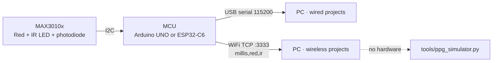

# Hardware

## Bill of materials

Per sensor node. Prices are rough 2026 street prices for planning only.

| Part | Qty | ~USD | Notes |
|------|----:|-----:|-------|
| MAX30102 or MAX30105 breakout | 1 | 5–12 | MAX30105 adds a green LED; either works. Prefer boards with a 3.3 V regulator and level shifting. |
| Arduino UNO / Nano (wired) | 1 | 8–25 | Any AVR board with I²C. |
| Adafruit Feather ESP32-C6 (wireless) | 1 | 15–20 | Other ESP32 boards work; update the I²C pins in the sketch. |
| LiPo battery 400–1000 mAh (wireless) | 1 | 6–10 | JST-PH, for untethered recording. |
| Dupont jumper wires | 4 | 1 | GND, 3V3, SDA, SCL. |
| USB cable | 1 | 2 | Data-capable, not charge-only. |
| 3D-printed case (`hardware/stl/`) | 1 | ~0.2 filament | Two-piece clip; stabilises optical contact. |
| Hook-and-loop strap | 1 | 1 | Holds the case on wrist or finger. |

A class of 12 students in groups of 3 needs **4 nodes**. Budget one spare sensor.

## Wiring

Same four wires for every board. The MAX3010x runs at 3.3 V logic.

```text
 MAX3010x            Arduino UNO/Nano        Feather ESP32-C6
 --------            ---------------         ----------------
   GND  ------------------ GND ------------------ GND
   VIN  ------------------ 3.3V ----------------- 3.3V
   SDA  ------------------ A4 / SDA ------------- SDA (IO19)
   SCL  ------------------ A5 / SCL ------------- SCL (IO18)
   INT  ------  not connected  ------
```



## Firmware

Sketches live in `hardware/`. Each is a self-contained streamer — no project logic on the MCU.

| Project | Wired sketch | Stream | Wireless sketch | Stream |
|---------|--------------|--------|-----------------|--------|
| 01, 02, 03, 05 | `wired-arduino/project-0X-ir-streamer/` | `time_us,ir` | `wireless-esp32/project-0X-wifi-ir-streamer/` | `millis,red,ir` |
| 04 | `wired-arduino/project-04-red-ir-streamer/` | `time_us,red,ir` | `wireless-esp32/project-04-wifi-red-ir-streamer/` | `red,infrared` |

The Python parsers take the **last** numeric value(s) per line, so timestamped and bare formats
both work. Projects 01–03 and 05 use IR only; Project 04 needs paired Red + IR.

### Required Arduino library

**SparkFun MAX3010x Pulse and Proximity Sensor Library** (`MAX30105.h`). Install via the Arduino
Library Manager. For ESP32, also install the **esp32** boards package.

### Wireless network modes

- **Access Point (default):** leave `WIFI_SSID` / `WIFI_PASSWORD` on their placeholders. The board
  creates `PPG_STREAM_groupN` (password `12345678`). Connect the PC's WiFi to it; use host
  `192.168.4.1`, port `3333`. Best for classrooms with locked-down WiFi.
- **Router mode:** set your WiFi credentials in the sketch. Read the assigned IP from the Serial
  Monitor; use that IP, port `3333`.

## Sample rate

The sensor's effective output rate is `SAMPLE_RATE / SAMPLE_AVERAGE`.

| Sketch | `SAMPLE_RATE` | `SAMPLE_AVERAGE` | Effective rate | Matches Python default (100 Hz)? |
|--------|--------------:|-----------------:|---------------:|:--:|
| Wired Arduino (shipped) | 100 | 1 | 100 Hz | yes |
| Wireless ESP32 (shipped) | 100 | 1 | 100 Hz | yes |

> Older copies of the ESP32 sketch shipped with `SAMPLE_AVERAGE = 4` (effective **25 Hz**), which
> did **not** match the Python default. If you see ~25 Hz in `tools/check_setup.py --stream`,
> update the sketch to `SAMPLE_AVERAGE = 1`, or set `sampling_rate_hz = 25.0` in the project config.

If you deliberately change the rate or averaging, keep the value identical across collection,
training, and live inference, and re-collect the dataset.

## Sensor placement

- Gentle, stable contact. Hard pressure collapses perfusion and flattens the waveform.
- Fingertip (pad) gives the strongest signal; wrist is more realistic but noisier.
- Shield from strong direct light. Keep the cable still for motion-sensitive projects (01).
- Give the signal ~15–20 s to stabilise before recording — every protocol builds this in.

## Photos

Add setup photos to `docs/assets/images/` (`hardware/`, `stl/`, `project-04/`). Avoid faces,
ID badges, screens with participant data, or handwritten notes.
